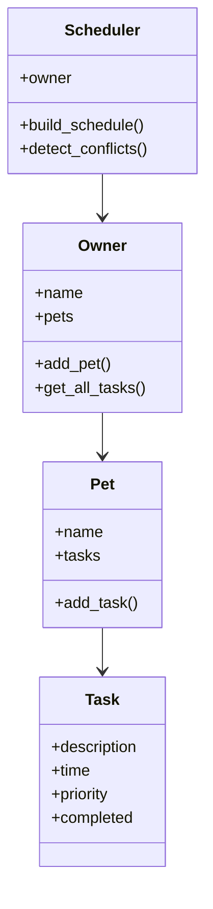

# 🐾 PawPal+ AI Scheduling System

## Project Evolution

This project is an extension of my PawPal+ system from Module 2. The original system allowed users to add pets and tasks and view a simple schedule.

In this version, I enhanced the system by adding AI-like scheduling logic, conflict detection, priority-based decisions, and explanation generation. The system now makes decisions about which tasks to schedule and explains why.

---

## 🚀 Features

* Add pets and tasks
* View daily schedule
* Detect scheduling conflicts
* Priority-based task selection
* Smart AI scheduling with explanations
* Input validation (guardrails)

---

## 🧠 AI Feature: Smart Scheduling

The system simulates AI behavior using rule-based decision making:

* Tasks are sorted by **priority and time**
* When conflicts occur, the system selects the **higher priority task**
* Invalid inputs (like incorrect time format) are ignored
* The system generates explanations for each decision

This creates a transparent and interpretable decision-making process similar to an AI system.

---

## ⚙️ Setup Instructions

1. Install dependencies:

```bash
pip install streamlit
```

2. Run the application:

```bash
python -m streamlit run app.py
```

3. Run tests:

```bash
python test_system.py
```

---

## 📊 Sample Input/Output

### Example 1: No Conflicts
**Input:**
- Pet: "Buddy"
- Task 1: "Feed dog" at "08:00" (priority 5)
- Task 2: "Walk dog" at "09:00" (priority 3)

**Output:**
```
Feed dog scheduled at 08:00 (priority 5)
Walk dog scheduled at 09:00 (priority 3)
```

### Example 2: Conflict Resolution
**Input:**
- Pet: "Buddy"
- Task 1: "Feed dog" at "08:00" (priority 5)
- Task 2: "Play" at "08:00" (priority 2)

**Output:**
```
Feed dog scheduled at 08:00 (priority 5)
Play skipped due to conflict at 08:00
```

### Example 3: Invalid Time Format
**Input:**
- Task: "Feed" at "25:99" (invalid)

**Output:**
```
Feed skipped due to invalid time
```

---

## 🧩 System Architecture

User → Streamlit UI → Scheduler → Tasks → Output

The Scheduler processes tasks, applies decision logic, resolves conflicts, and generates explanations.

---

## 🧩 System Design (UML)



---

## 🧪 Experiments and Scenarios

### Scenario 1: No Conflict

* Tasks: Feed (08:00), Walk (09:00)
* Result: Both tasks scheduled

### Scenario 2: Conflict at Same Time

* Tasks: Feed (08:00), Walk (08:00)
* Result: One task scheduled based on priority

### Scenario 3: Multiple Pets Conflict

* Dog: Feed (08:00)
* Cat: Feed (08:00)
* Result: Conflict handled across pets

---

## 🧪 Testing Summary

I created a test script (`test_system.py`) to evaluate system behavior.

Results:

* Test 1 (no conflict): Passed
* Test 2 (conflict): Passed

The system consistently handled conflicts and produced correct schedules.

---

## 🛡️ Reliability and Guardrails

The system includes guardrails to improve reliability:

* Tasks with invalid time formats are skipped
* Conflicts are resolved using priority-based selection
* Explanations are generated for all decisions

These features ensure consistent and predictable behavior.

---

## 💡 Sample Interaction

Input:

* Feed dog at 08:00
* Walk dog at 08:00

Output:

* Feed scheduled
* Walk skipped

Explanation:
"Walk skipped due to conflict at 08:00"

---

## 🤖 AI Collaboration

I used AI tools to assist with debugging, improving code structure, and designing the scheduling logic.

One helpful suggestion was organizing the system using classes such as Owner, Pet, Task, and Scheduler, which improved modularity.

However, some AI suggestions were too generic or did not fully match the project requirements. I had to adjust the logic to correctly handle conflicts and priorities.

This experience showed me that AI is helpful for guidance, but human validation is necessary.

---

## 🧠 Reflection

This project helped me understand how scheduling systems work and how conflicts can be resolved automatically.

I learned how to design a system that not only makes decisions but also explains them. This made the system more transparent and easier to understand.

I also realized that even simple rule-based systems can simulate AI behavior, but they have limitations and require careful testing.

---

## 🎥 Demo Video

(Add your Loom video link here)
