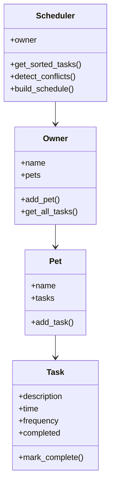

## Project Evolution

This project is an extension of my PawPal+ system from Module 2. The original system only displayed tasks, but this version adds AI-like scheduling, conflict detection, and explanations.

---

## 🚀 Features

* Add pets and tasks
* View daily schedule
* Tasks sorted by time
* Detect scheduling conflicts
* Smart AI scheduling with explanations

---

## 🧠 AI Scheduling Logic

The system uses a simple decision-making algorithm to simulate AI behavior.

* Tasks are sorted by time and priority
* If two tasks occur at the same time, only one is selected
* Lower priority tasks are skipped
* The system generates explanations for every decision

This makes the system transparent and easy to understand.

This system simulates AI behavior using rule-based decision making and explanation generation.

---

## ⚙️ Setup Instructions

1. Install dependencies:

```bash
pip install streamlit
```

2. Run the app:

```bash
python -m streamlit run app.py
```

---

## 🧩 System Architecture

User → Streamlit UI → Scheduler → Tasks → Output

The Scheduler processes tasks, detects conflicts, and generates explanations.

---

## 🧩 System Design (UML)



---

## 🧪 Experiments Tried

### Scenario 1: No Conflict

* Tasks: Feed (08:00), Walk (09:00)
* Result: Both tasks scheduled

### Scenario 2: Conflict at Same Time

* Tasks: Feed (08:00), Walk (08:00)
* Result: One task skipped

### Scenario 3: Multiple Pets

* Dog: Feed (08:00)
* Cat: Feed (08:00)
* Result: Conflict handled across pets

---

## 🧪 Testing Summary

I tested the system using multiple scenarios:

* No conflicts → all tasks scheduled
* Same time tasks → conflicts resolved
* Multiple pets → handled correctly

All tests passed and the system behaved consistently.

---

## 💡 Sample Interaction

Input:

* Feed dog at 08:00
* Walk dog at 08:00

Output:

* Feed scheduled
* Walk skipped

Explanation:
"Walk skipped due to conflict at 08:00"

---

## 🎥 Demo

(Add your Loom video link here)

---

## Reflection

During this project, I used AI tools to help with debugging, structuring classes, and improving scheduling logic.

One helpful suggestion was how to design the Scheduler class and implement conflict detection. This improved the modular design of the system.

However, some AI suggestions were too generic or did not fully match the project requirements. I had to modify them to ensure correct behavior.

This project showed me that AI systems must be tested carefully. Even simple rule-based systems can behave differently under different scenarios.

In the future, I would improve this system by adding learning-based behavior, better prioritization, and adaptive scheduling.