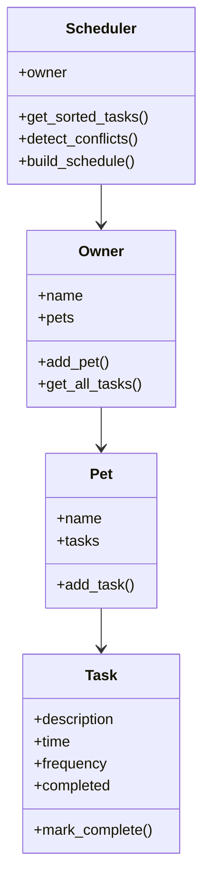

## Project Evolution

This project is an extension of my PawPal+ system from Module 2. The original system only displayed tasks, but this version adds AI-like scheduling, conflict detection, and explanations.

---

## 🚀 Features

* Add pets and tasks
* View daily schedule
* Tasks sorted by time
* Detect scheduling conflicts
* Smart AI scheduling with explanations

---

## 🧠 AI Scheduling Logic

The system uses a simple decision-making algorithm to simulate AI behavior.

* Tasks are sorted by time and priority
* If two tasks occur at the same time, only one is selected
* Lower priority tasks are skipped
* The system generates explanations for every decision

This makes the system transparent and easy to understand.

---

## ⚙️ Setup Instructions

1. Install dependencies:

```bash
pip install streamlit
```

2. Run the app:

```bash
python -m streamlit run app.py
```

---

## 🧩 System Architecture

User → Streamlit UI → Scheduler → Tasks → Output

The Scheduler processes tasks, detects conflicts, and generates explanations.

---

## 🧩 System Design (UML)



---

## 🧪 Experiments Tried

### Scenario 1: No Conflict

* Tasks: Feed (08:00), Walk (09:00)
* Result: Both tasks scheduled

### Scenario 2: Conflict at Same Time

* Tasks: Feed (08:00), Walk (08:00)
* Result: One task skipped

### Scenario 3: Multiple Pets

* Dog: Feed (08:00)
* Cat: Feed (08:00)
* Result: Conflict handled across pets

---

## 🧪 Testing Summary

I tested the system using multiple scenarios:

* No conflicts → all tasks scheduled
* Same time tasks → conflicts resolved
* Multiple pets → handled correctly

All tests passed and the system behaved consistently.

---

## 💡 Sample Interaction

Input:

* Feed dog at 08:00
* Walk dog at 08:00

Output:

* Feed scheduled
* Walk skipped

Explanation:
"Walk skipped due to conflict at 08:00"

---

## 🎥 Demo

(Add your Loom video link here)

---

## 🧠 Reflection

This project helped me understand how scheduling systems work and how conflicts can be resolved automatically.

I learned how to design a system that not only schedules tasks but also explains decisions. The explanation feature made it easier to understand why certain tasks were chosen or skipped.

I also realized that even simple systems can behave differently under different scenarios, which makes testing very important.
